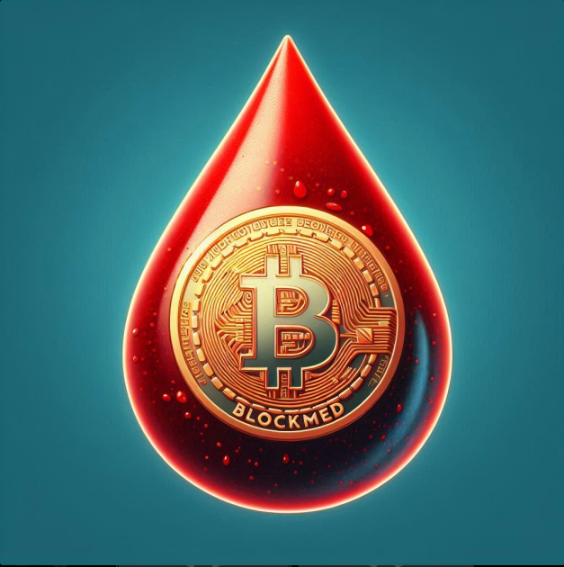

# BlockMed

**Blockmed** BlockMed é uma plataforma desenvolvida para gerenciar a venda de exames de sangue de forma segura e transparente utilizando a plataforma Ethereum através de Contratos Inteligentes. Este projeto foi criado para garantir a privacidade dos pacientes e a autenticidade das transações médicas.

O BlockMed permite que laboratórios registrem exames de sangue e vendam os resultados de forma segura. O sistema utiliza Ethereum para garantir a imutabilidade e a rastreabilidade dos registros, proporcionando uma camada adicional de segurança e confiança.

## Tecnologias Utilizadas
- Solidity: Linguagem de programação para contratos inteligentes.
- Ethereum: Plataforma blockchain utilizada para deploy do contrato.
- Sepolia Testnet: Rede de teste utilizada para implantação do contrato.
- Ganache: Ferramenta para simular a blockchain localmente.
- Web3.js: Biblioteca para interagir com a blockchain Ethereum através de JavaScript.

## Funcionalidades
- Registro de Pacientes: Armazenamento seguro das informações dos pacientes.
- Venda de Exames: Transferência de dados de exames de sangue entre laboratórios e compradores.
- Transações Seguras: Uso da blockchain Ethereum para garantir a segurança e imutabilidade das transações.
- Interface Gráfica: Uma interface simples para facilitar a interação com o usuário final.

## Estrutura do Projeto
A estrutura do projeto é baseada na tecnologia blockchain, que, por meio de Contratos Inteligentes e integração com a Metamask permite a comunicação entre pacientes, clínicas e laboratórios de pesquisa. 

A fim de compreender mais acerca da implementação do projeto, acesse nossa [arquitetura UML](./docs/Architecture/UML_architecture.png).

## Dependências do projeto
- Node
- Express web3
- Nodemailer  -- Criar uma senha para apps na configuração do email do google
- Dotenv
- Ethers
- Ganache-cli

## Business Model Canvas 
Para visualizar nosso Business Model Canvas (BMC), acesse o [link](BMC/BMC.png) 

## Demonstração
O vídeo abaixo demonstra o funcionamento da plataforma. 

[Vídeo com a Demo](https://youtu.be/8ZUltkozZgM?feature=shared).

## Transações feitas na rede de testes
[Rede Sepolia de testes](https://sepolia.etherscan.io/address/0x516b1175fef9298f21d73c08f32fb7753594dece)

## Contato
- Ana Clara Coelho
- Guilherme Souza
- Nicolas Freitas

## Licença
Este projeto é licenciado sob a Licença MIT.
